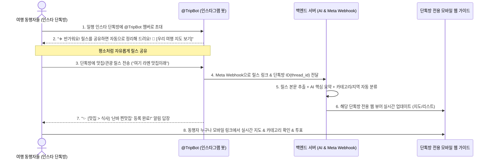

# ✈️ 여행 릴스 자동 큐레이션 서비스 기획서 (Service Plan)

---

## 📌 1. 프로젝트 개요 (Overview)
- **서비스명**: 트립릴스 (TripReels - 가칭)
- **서비스 정의**: 인스타그램 그룹 DM(단톡방)에 봇을 초대하기만 하면, 대화방에 공유되는 모든 여행 릴스를 자동으로 수집·분석하여 일행 전용 실시간 모바일 여행 가이드로 변환해 주는 서비스.
- **핵심 차별점**: **"회원가입도, 방 생성도 필요 없음. 인스타 단톡방에 봇(@TripBot) 초대 1번으로 끝!" (Zero-Friction Ingestion)**
- **타겟 사용자**: 친구, 연인, 모임 등 2인 이상의 동행자와 인스타그램 단톡방에서 여행 릴스를 주고받는 모든 사용자.

---

## 💡 2. 제품 비전 & 제로 프릭션 UX (Core Value)
> **"이미 일행과 쓰고 있는 인스타 단톡방에 봇을 초대하세요. 대화창에 릴스를 올리면 우리만의 여행 지도가 완성됩니다."**

- **번거로운 절차 제로**: 웹사이트 가입, 방 만들기, 고유 코드 입력 등의 복잡한 단계 완전 제거.
- **자연스러운 일상 대화 흐름 유지**: 일행들이 평소 하던 대로 인스타 단톡방에 릴스를 공유하면 백그라운드에서 AI가 자동 정리.
- **단톡방 전용 실시간 지도 제공**: 봇이 단톡방마다 고유한 모바일 웹 링크를 즉시 발급하여 동행자 전원이 함께 조회.

---

## 📱 3. 사용자 여정 플로우 (User Journey Flow)



---

## 💬 4. 인스타그램 챗봇 대화 시나리오 및 응답 템플릿 (Chatbot Script Specs)

### 1) 단톡방 초대 시 최초 인사말
```text
✈️ 안녕하세요! 여행 릴스 큐레이터 봇입니다!
이 단톡방에 인스타그램 릴스를 공유해 주시면, 제가 알아서 맛집·관광지·쇼핑·교통별로 착착 정리해 드려요! 🗺️

📱 [우리 단톡방 전용 여행 지도 보러가기]
https://tripreels.app/?g={thread_id}
```

### 2) 릴스 공유 시 자동 등록 확인 메시지
```text
✨ [🍽️ 맛집 > 식사] '구로몬시장 85년 전통 장어덮밥' 등록 완료!
💬 요약: 9시 오픈 1시간 전 웨이팅 필수, 1마리 포장 전용 추천.
📍 지역: 난바 | 👤 공유자: 지은

👉 지도에서 위치 보기: https://tripreels.app/?g={thread_id}
```

### 3) 여행과 무관한 릴스(밈, 운동 등) 감지 시 필터링 메시지
```text
💡 [안내] 공유해 주신 릴스에서 여행 관련 장소나 정보를 찾지 못해 등록을 건너뛰었어요! (여행 맛집/관광지 릴스 위주로 자동 수집됩니다 ⛩️)
```

---

## 🗺️ 5. 모바일 뷰어 기능 명세 (Mobile Web Features)

1. **인터랙티브 여행 지도 (Interactive Map View)**:
   - 오사카/교토/간사이 주요 거점별 시각화 지도.
   - 카테고리별 컬러 핀 (🏛️관광: 청록, 🍽️맛집: 코랄레드, 🛍️쇼핑: 오렌지, 🚌교통: 블루).
   - 핀 클릭 시 하단 플로팅 카드로 요약 및 구글 지도 길찾기 연동.
2. **동행자 협업 기능 (Collaboration)**:
   - **공유자 뱃지**: 단톡방에서 누가 공유했는지 투명하게 표시 (`👤 민수 공유`).
   - **가고 싶어요! 투표 (❤️ +1)**: 일행들이 마음에 드는 장소에 투표하여 인기 스팟 취합.
3. **독립 단톡방 라우팅**:
   - `?g=방코드` 형태로 단톡방마다 완벽히 분리된 데이터베이스 제공.

---

## 🗄️ 6. 데이터베이스 모델링 (Database Schema)

### 1) `GroupThreads` (단톡방 매핑)
- `id` (UUID, PK)
- `instagram_thread_id` (VARCHAR, Unique - 인스타 단톡방 고유 ID)
- `group_slug` (VARCHAR, Unique - 웹 접속용 난수 코드, 예: 'osk-9872')
- `title` (VARCHAR - 단톡방 이름)
- `destination` (VARCHAR - 여행지)
- `created_at` (TIMESTAMP)

### 2) `Reels` (단톡방에 수집된 릴스 데이터)
- `id` (UUID, PK)
- `group_id` (UUID, FK -> GroupThreads.id)
- `url` (TEXT - 인스타 릴스 URL)
- `title` (VARCHAR - AI 추출/정리 제목)
- `memo` (TEXT - AI 생성 1~2줄 핵심 요약)
- `primary_category` (VARCHAR - 'sightseeing', 'dining', 'shopping', 'transit', 'aviation', 'tips')
- `sub_category` (VARCHAR - 'spot', 'meal', 'snack', 'shoplist', 'fashion', 'pass', 'tip')
- `region` (VARCHAR - '난바', '우메다', '교토', '간사이공항' 등)
- `lat` (DECIMAL - 위도)
- `lng` (DECIMAL - 경도)
- `votes` (INTEGER - 가고 싶어요 투표 수)
- `sender_name` (VARCHAR - 공유한 사람 닉네임)
- `is_favorite` (BOOLEAN - 북마크)
- `created_at` (TIMESTAMP)
