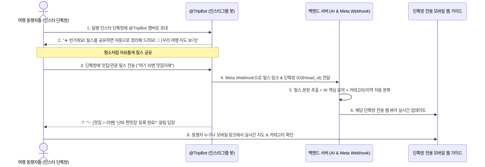

# ✈️ 여행 릴스 자동 큐레이션 서비스 기획서 (Service Plan)

---

## 📌 1. 프로젝트 개요 (Overview)
- **서비스명**: 트립릴스 (TripReels - 가칭)
- **서비스 정의**: 인스타그램 그룹 DM(단톡방)에 봇을 초대하기만 하면, 대화방에 공유되는 모든 여행 릴스를 자동으로 수집·분석하여 일행 전용 실시간 모바일 여행 가이드로 변환해 주는 서비스.
- **핵심 차별점**: **"회원가입도, 방 생성도 필요 없음. 인스타 단톡방에 봇(@TripBot) 초대 1번으로 끝!" (Zero-Friction Ingestion)**
- **타겟 사용자**: 친구, 연인, 모임 등 2인 이상의 동행자와 인스타그램 단톡방에서 여행 릴스를 주고받는 모든 사용자.

---

## 💡 2. 제품 비전 & 제로 프릭션 UX (Core Value)
> **"이미 일행과 쓰고 있는 인스타 단톡방에 봇을 초대하세요. 대화창에 릴스를 올리면 우리만의 여행 지도가 완성됩니다."**

- **번거로운 절차 제로**: 웹사이트 가입, 방 만들기, 고유 코드 입력 등의 복잡한 단계 완전 제거.
- **자연스러운 일상 대화 흐름 유지**: 일행들이 평소 하던 대로 인스타 단톡방에 릴스를 공유하면 백그라운드에서 AI가 자동 정리.
- **단톡방 전용 실시간 지도 제공**: 봇이 단톡방마다 고유한 모바일 웹 링크를 즉시 발급하여 동행자 전원이 함께 조회.

---

## 📱 3. 사용자 여정 플로우 (User Journey Flow)



### 단계별 상세 시나리오

#### 1단계: 인스타 단톡방에 봇 초대 (최초 1회)
- 여행 일행들과의 기존 인스타그램 그룹 대화방(또는 1:1 대화)에 서비스 봇 계정(예: `@TripReels_Bot`)을 **멤버로 초대**.
- 봇이 단톡방에 입장하자마자 인사말과 함께 **단톡방 전용 모바일 웹 링크**를 전송:
  > *"✈️ 안녕하세요! 여행 릴스 큐레이터 봇입니다.*  
  > *이 대화방에 릴스를 올려주시면 알아서 맛집/관광/쇼핑별로 정리해 드려요!*  
  > *📱 [우리 단톡방 여행 지도 보러가기](https://tripreels.app/g/osk-9872)"*

#### 2단계: 평소처럼 자유로운 릴스 공유
- 일행 중 누구든지 인스타 피드를 보다가 단톡방에 릴스를 공유.
- 봇이 릴스를 실시간 감지하여:
  - 🍜 **맛집/카페**, ⛩️ **관광/명소**, 🛍️ **쇼핑**, 🚌 **교통/통신**, 💡 **여행 꿀팁**으로 자동 분류.
  - 영상 속 장소(난바, 우메다, 교토 등) 및 핵심 2줄 요약 자동 생성.

#### 3단계: 실시간 동행자 모바일 가이드 활용
- 단톡방 공지나 봇이 준 링크를 누르면, 일행이 공유한 모든 릴스가 **Apple 스타일의 미니멀 모바일 웹**으로 정돈되어 실시간 표시.
- 여행 현장에서 카테고리별/지역별로 즉시 찾아보고, 구글 지도 연동, 북마크(❤️), 삭제(🗑️) 가능.

---

## 🏗️ 4. 기술 아키텍처 & 단톡방 식별 구조

```
[ 인스타그램 그룹 DM 대화방 ]
  - 일행 A, 일행 B, @TripBot 참가
  - 릴스 공유 이벤트 발생
         │ (Meta Instagram Messaging Webhook)
         ▼
[ Next.js / Node.js 백엔드 Webhook ]
   ├── ① Instagram thread_id (단톡방 고유 식별자) 자동 감지
   ├── ② DB에 thread_id 기반 그룹 방 자동 생성 / 매핑
   ├── ③ 미디어 캡션 추출 (Instaloader / Meta Graph API)
   ├── ④ AI / NLP 핵심 요약 및 카테고리 자동 분류기
   └── ⑤ PostgreSQL / Supabase 저장 및 실시간 WebSocket 전송
         │
         ├── Realtime Sync ──► [ 단톡방 전용 React 모바일 웹앱 ]
         └── Meta Send API ──► [ 인스타 단톡방에 등록 완료 알림 답장 ]
```

---

## 🗄️ 5. 데이터베이스 모델링 (Database Schema)

### 1) `GroupThreads` (단톡방 매핑)
- `id` (UUID, PK)
- `instagram_thread_id` (VARCHAR, Unique - 인스타 단톡방 고유 ID)
- `group_slug` (VARCHAR, Unique - 웹 접속용 난수 코드, 예: 'osk-9872')
- `title` (VARCHAR - 단톡방 이름)
- `created_at` (TIMESTAMP)

### 2) `Reels` (단톡방에 수집된 릴스 데이터)
- `id` (UUID, PK)
- `group_id` (UUID, FK -> GroupThreads.id)
- `url` (TEXT - 인스타 릴스 URL)
- `title` (VARCHAR - AI 추출/정리 제목)
- `memo` (TEXT - AI 생성 1~2줄 핵심 요약)
- `primary_category` (VARCHAR - 'sightseeing', 'dining', 'shopping', 'transit', 'aviation', 'tips')
- `sub_category` (VARCHAR - 'spot', 'meal', 'snack', 'shoplist', 'fashion', 'pass', 'tip')
- `region` (VARCHAR - '난바', '우메다', '교토', '간사이공항' 등)
- `sender_name` (VARCHAR - 단톡방에서 보낸 사람 닉네임)
- `is_favorite` (BOOLEAN - 북마크)
- `created_at` (TIMESTAMP)

---

## 🚀 6. 개발 로드맵 (Milestones)

- [x] **Phase 1: 모바일 뷰어 & 키워드 자동 분류 엔진 구축 (완료)**
- [ ] **Phase 2: 고유 그룹 URL 기반 다중 단톡방 뷰어 구현 (Next Step)**
  - URL 경로별(`https://.../g/:groupId`) 독립된 릴스 데이터 로딩 지원
  - 클라우드 DB 연동 (Supabase/PostgreSQL)
- [ ] **Phase 3: Meta Instagram Messaging API Webhook & 단톡방 봇 연동**
  - 단톡방 초대 이벤트(`thread_id`) 수신 및 그룹 자동 생성 로직
  - 단톡방 내 릴스 수신 시 자동 파싱 ➔ 요약 ➔ 웹 배포 ➔ 확인 답장 파이프라인
- [ ] **Phase 4: 구글 지도 핀 연동 & 오프라인 지원**
